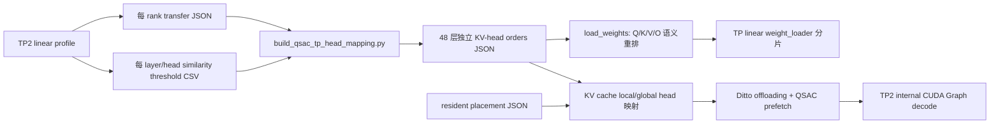

# Ditto TP、CUDA Graph 与 Head Balance 修改交接说明

> 更新时间：2026-09-06
> 仓库：`/nfs/xxl/sglang-litecache`
> 目标分支：`TP_support`
> 改动来源：本地 `main` 的未推送提交 `da47035319c42eab86066dabddfce02ce1e5299a` (`TP-support`)
> 远程基线：`origin/main` = `0ab3b7aa1b3d9cf7e978e1007e9c4ac4ea60a618`

## 0. 给后续 AI 的结论

这批改动的核心目标是让 Ditto 的 Qwen2/Llama offloading 路径支持单机 Tensor Parallel，并在 TP2 下开启 Ditto 内部 CUDA Graph；在此基础上，用实际 QSAC miss、head similarity/hard-to-reuse 信息和 resident placement 对每一层的 KV head 做不同的 TP 映射，降低最慢 TP rank 的 decode 关键路径。

目前核心链路已经可以在 `Qwen2.5-14B-Instruct-1M`、TP2、PP1 下运行。128K 的最佳已测配置是：

- per-layer mapping：`test/ditto/speedup/head-mapping-ab/qsac-resident-layerwise-128K.json`
- explicit resident placement：`test/ditto/speedup/head-mapping-ab/resident-placement/l25-none.json`
- linear baseline：`40.6323 ms/token`，`24.6110 token/s`
- 最佳结果：`39.6077 ms/token`，`25.2479 token/s`
- 相对 linear：decode TPS `+2.59%`，decode latency `-2.52%`

这不是完整收尾状态：128K 训练出的 mapping 在 8K 测试中出现大幅抖动，64K 的最终多长度测试尚未完成，prefix hit 也尚未纳入目标函数。

## 1. 推送前的 P0 风险

改动来源提交 `da4703531` **不应该原样推送**。它误纳入了与功能无关的本地文件和构建产物，其中包括：

- `.codex/auth.json`：可能包含凭据。本文没有读取或复制其内容，推送前必须从 Git 历史中移除；如果是真实凭据，建议同时轮换。
- `.codex/config.toml`
- `sgl-kernel/.cmake-build-py313-sm86/`：CMake/Ninja 构建目录。
- `router-sglang-mooncake-kvcache_flow.html`
- `test_log/`、预测输出、smoke 输出及大量 benchmark 原始结果。

该提交总计约 664 个文件；仅 `.codex`、构建目录和 HTML 在 Git tree 中就约 43.6 MiB。后续 AI 在执行 push 前，应先重写尚未推送的本地提交，只保留源码、测试、必要配置、mapping 输入和本交接文档。不要通过新增一个“删除文件”的后续提交来处理凭据，因为凭据仍会存在于可访问的 Git 历史中。

建议保留的核心范围：

```text
python/sglang/ditto/
python/sglang/srt/models/ditto/
python/sglang/srt/models/transformers.py
python/sglang/srt/configs/model_config.py
python/sglang/jit_kernel/{hisparse.py,csrc/hisparse.cuh,include/...}
sgl-kernel/csrc/kvlib/ham_dist.cu
test/ditto/*.py
test/ditto/*.sh
test/ditto/config/hata_offloading/*.yaml
test/ditto/speedup/{n2n_offloading.py,run_n2n_*.sh,build_qsac_tp_head_mapping.py}
test/registered/jit/test_hisparse.py
必要的 mapping/resident JSON
DITTO_TP_HANDOFF.md
```

## 2. 修改目的

### 2.1 Ditto 支持真正的 Tensor Parallel

原始 Ditto 模型和 KV cache 主要按单卡假设实现。虽然 SGLang Engine 可以接收 `tp_size`，但 Ditto 的 attention head 数、Q/K/V/O 权重、cache tensor 和 offloading metadata 没有完整地按 TP rank 切分。

本次改动补齐了：

1. Q head 和 KV head 的本地布局计算。
2. Q/K/V column-parallel、O row-parallel，以及 MLP TP linear 替换。
3. GQA 下 Q head 与 KV head 分组关系。
4. checkpoint 权重按每层语义 head 顺序重排后再交给 TP weight loader 分片。
5. cache、QSAC threshold、prefetch mask、resident head 在 local/global head ID 之间的一致映射。

### 2.2 TP 下启用 Ditto 内部 CUDA Graph

SGLang 全局 CUDA Graph 和 Ditto 内部 decode CUDA Graph 是两个开关。测试采用：

```text
SGLANG_CUDA_GRAPH=0
DITTO_CUDA_GRAPH=1
DITTO_TP_ENABLE_CUDA_GRAPH=1
```

TP 下 CUDA Graph capture 会经过 SGLang distributed `graph_capture()`，使 TP collective/NCCL buffer 在 capture/replay 前注册。出于安全考虑，模型代码默认仍会在 TP 下关闭 Ditto 内部 graph，只有显式设置 `DITTO_TP_ENABLE_CUDA_GRAPH=1` 才启用；benchmark shell 会让它默认跟随 `DITTO_CUDA_GRAPH`。

### 2.3 降低 TP head 不均衡

TP decode latency 由较慢 rank 决定。简单 linear allocation 把连续 KV heads 分给两个 rank；简单 global balance 用同一个 head permutation 覆盖所有层。这两种方法都没有表达以下差异：

- 每层 QSAC miss pattern 不同。
- head similarity 和 hard-to-reuse head 不同。
- resident head 不发生同样的稀疏 H2D prefetch，其代价不能按普通 QSAC miss 计算。
- 每个 decode step 的 miss burst 和跨层累计负载不同。

因此实现了每层独立的 mapping，并让优化器同时考虑 QSAC 和 resident placement。

## 3. 实现数据流



关键约束是：不能只改变 cache 看到的 head ID，而不改变模型权重。否则 Q/K/V/O 的语义不再对应，结果会错误。当前实现先按每层 order 对 checkpoint 的 head axis 重排，再执行标准 TP 分片，cache 使用相同 order。

## 4. 核心代码改动

### 4.1 TP runtime 与模型权重

主要文件：`python/sglang/srt/models/ditto/ditto.py`

- 新增 `_DittoTPHeadLayout`，统一计算 TP rank/size、attention TP rank/size、local Q/KV head 数、KV replication。
- 当前只允许单机 pure TP；明确拒绝 PP、DP attention、context parallel 和 scattered attention input。
- 将 `q_proj/k_proj/v_proj/gate_proj/up_proj` 替换为 column-parallel linear。
- 将 `o_proj/down_proj` 替换为 row-parallel linear。
- 当 `num_kv_heads < tp_size` 时，K/V linear 使用较小逻辑 TP group 的 rank/size，支持 replicated KV head 场景。
- `_maybe_reorder_ditto_attention_weight()` 对每层权重做语义重排：
  - Q weight/bias：axis 0 按扩展后的 GQA Q-head order 重排。
  - K/V weight/bias：axis 0 按 KV-head order 重排。
  - O weight：axis 1 按 Q-head order 重排。
- weight load 使用每个参数的 `weight_loader`，并排除 `.next_` alias，避免预取别名被重复加载。
- AWQ 替换同样跳过 `.next_` alias，并在 load 后 finalize。

配套文件：

- `python/sglang/srt/models/ditto/qwen2_utils.py`
- `python/sglang/srt/models/ditto/llama_utils.py`
- `python/sglang/srt/models/ditto/modeling_llama_offloading_duohead.py`
- `python/sglang/srt/models/transformers.py`

这些文件将 attention 的 `num_heads`、`num_key_value_heads` 和本地 hidden size 改为 TP-aware，并允许 `replace_linear_class()` 显式覆盖 `tp_rank/tp_size` 和保留参数 dtype。

### 4.2 每层 head mapping

新增文件：`python/sglang/ditto/tp_head_mapping.py`

支持三个环境变量：

| 环境变量 | 作用 |
| --- | --- |
| `DITTO_TP_KV_HEAD_ORDER` | 单个全局 KV-head permutation；`linear/contiguous/identity` 表示原顺序。 |
| `DITTO_TP_KV_HEAD_ORDER_FILE` | JSON 文件，每层一个 permutation；优先级高于全局 order。 |
| `DITTO_RESIDENT_HEADS_FILE` | JSON 文件，每层列出需要常驻 GPU 的 original/global KV head ID。 |

mapping 文件要求 `orders` 的数量严格等于模型层数，每个 order 必须是 `[0, num_kv_heads)` 的完整排列。Qwen2.5-14B 有 48 层、8 个 KV heads；TP2 下 order 的前 4 个 head 分给 rank 0，后 4 个分给 rank 1。

当前 128K resident-aware mapping 有 48 个独立 order，rank 0 的 head group 在 48 层中有 26 种不同组合，满足“每层使用不同映射”的设计目标。

### 4.3 KV cache 和 offloading

主要文件：

- `python/sglang/ditto/kvcache_full_attn.py`
- `python/sglang/ditto/kvcache_offloading.py`
- `python/sglang/ditto/kvcache_hash.py`
- `python/sglang/ditto/kvcache_offloading_{hash,infinigen,loki}.py`

主要变化：

- cache tensor 按本地 KV head 数分配，不再按全局 head 数重复分配。
- 保存 `local_kv_head_ids_by_layer` 和 `local_query_head_ids_by_layer`。
- threshold、hash weight、skewing matrix 等 head-major tensor 从全局布局按每层本地 ID 切片。
- 输出日志和统计时把 local head ID 转回 original/global head ID。
- explicit resident placement 覆盖自动 heuristic；skip layer 必须保持该 rank 的所有本地 head resident。
- 如果 explicit placement 超出 memory budget，直接报错，不静默改变用户指定的 placement。

`test/ditto/config/hata_offloading/Qwen2.5-14B-Instruct-1M-32K.yaml` 的 `num_skip_layers` 已从错误的 `48` 改成 `1`。原值会让 48 层全部常驻，实际上绕开 offloading，无法用于有效的 head balance 实验。

### 4.4 QSAC 与 transfer 统计

主要文件：`python/sglang/ditto/transfer_stats.py`

- JSON/CSV 增加 `attn_tp_rank` 和 `attn_tp_size`。
- TP 模式下自动给输出文件添加 `.tp00/.tp01` 后缀，避免多个 rank 覆盖同一个文件。
- `DITTO_RECORD_HEAD_MASKS=1` 时记录每层每个本地 KV head 的 QSAC gather/miss mask，以及该层 local-to-global head ID。
- per-layer 和 per-head CSV 可用于分析 H2D/D2H bytes、prefetch heads、selected tokens、overlap 指标和 head similarity。

常用统计环境变量：

```text
DITTO_RECORD_TRANSFER_STATS=1
DITTO_RECORD_HEAD_MASKS=1
DITTO_TRANSFER_STATS_FILE=/path/run-transfer.json
DITTO_TRANSFER_STATS_CSV_FILE=/path/run-transfer.csv
DITTO_TRANSFER_STATS_PER_HEAD_CSV_FILE=/path/run-transfer-per-head.csv
DITTO_HEAD_THRESHOLD_CSV_FILE=/path/run-head-thresholds.csv
```

### 4.5 Mapping 生成器

新增文件：`test/ditto/speedup/build_qsac_tp_head_mapping.py`

当前生成器专门求解 TP2。对每层枚举 8 个 KV heads 的 4/4 分组，并按字典序目标选择：

1. resident head 数在两个 rank 间的差异。
2. 单 rank resident head 数上界。
3. aggregate 或 stepwise QSAC critical-rank miss load。
4. rank 间 miss 差异。
5. 总 miss 和稳定 tie-break。

resident-aware 模式中：

```text
resident_count = max(hard_to_reuse_heads - num_overlapped_heads, 0)
```

优先把 reuse difficulty 更大的 hard head 视为 resident。跨层还允许交换两个分组的 rank 归属，以平衡累计 effective load：

```text
effective_load = offloaded_qsac_misses
               + resident_head_count * steady_steps * (1 / topk_ratio)
```

这里把 resident dense cost 粗略换算成 sparse miss 等价量。它比只数 resident head 更精细，但仍不是最终精确模型，尚未纳入 head_dim、实际传输 byte、PCIe/GDR 并发、cache hit、kernel 时间和 prefix hit 分布。

### 4.6 CUDA Graph

主要文件：

- `python/sglang/srt/models/ditto/offloading_ops.py`
- `python/sglang/srt/configs/model_config.py`
- `test/ditto/speedup/run_n2n_qwen_offloading_seqlen.sh`

主要变化：

- TP2 capture 外层增加 distributed `graph_capture()`。
- Ditto architecture 禁用 SGLang piecewise CUDA Graph。
- benchmark 默认关闭 SGLang 全局 graph、开启 Ditto 内部 graph。
- TP 内部 graph 通过 `DITTO_TP_ENABLE_CUDA_GRAPH` 显式 gate。

### 4.7 Benchmark 和 accuracy 入口

`test/ditto/speedup/n2n_offloading.py` 和两个 `run_n2n_qwen_*_seqlen.sh` 增加：

- `TP_SIZE` / `--tp-size`
- `PP_SIZE` / `--pp-size`
- graph、memory、chunked prefill、KV cache dtype 等可覆盖项
- runtime result JSON 中保存 TP/PP 和 graph 状态
- `max_total_tokens`、`chunk_prefill_size` 优先使用显式参数，否则读取 YAML

accuracy shell 的多 GPU 默认方式从 PP 改为 TP，并限制 Ditto `PP_NUM=1`。`test/ditto/run_pred.py` 也会显式拒绝 Ditto PP > 1。

### 4.8 HiSparse JIT：同一提交中的独立工作流

下面的改动被包含在同一提交，但不属于 TP head balance 主链：

- `python/sglang/jit_kernel/csrc/hisparse.cuh`
- `python/sglang/jit_kernel/hisparse.py`
- `python/sglang/jit_kernel/include/sgl_kernel/deepseek_v4/kvcacheio.cuh`
- `test/registered/jit/test_hisparse.py`

它们实现 generic MLA 与 DeepSeek V4 paged C4 layout 的 sparse cache swap-in/transfer JIT wrapper，并覆盖 cache hit、miss、LRU、batch padding、DSV4 page layout 和 ROCm 大 LRU writeback 等测试。

`sgl-kernel/csrc/kvlib/ham_dist.cu` 另增加了 `NumHead={20,10,5}` 和 `NumKVHead=1` 的模板 dispatch，用于 TP 后更小的本地 head 形状。

## 5. JSON 契约

### 5.1 Per-layer mapping

最小结构：

```json
{
  "orders": [
    [0, 1, 2, 3, 4, 5, 6, 7],
    [0, 2, 5, 7, 1, 3, 4, 6]
  ]
}
```

实际文件还有 `metadata` 和 `layers`，用于保存 profile 来源、QSAC miss、sample count、resident heads 和两个 rank 的分组。runtime 只依赖 `orders`。

### 5.2 Explicit resident placement

最小结构：

```json
{
  "resident_heads": [
    [0, 1, 2, 3, 4, 5, 6, 7],
    [],
    []
  ]
}
```

head ID 是重排前的 original/global KV head ID。列表数量必须严格等于模型层数。

`l25-none.json` 的实际含义不是“所有层都没有 resident”：layer 0 因 `num_skip_layers=1` 全部 resident，layer 1 到 47 没有额外 resident。

## 6. 当前推荐运行方式

在容器 `xxl_sglang_ditto_v1` 的 `/workspace/sglang-litecache` 中运行：

```bash
cd /workspace/sglang-litecache

DITTO_TP_KV_HEAD_ORDER_FILE=/workspace/sglang-litecache/test/ditto/speedup/head-mapping-ab/qsac-resident-layerwise-128K.json \
DITTO_RESIDENT_HEADS_FILE=/workspace/sglang-litecache/test/ditto/speedup/head-mapping-ab/resident-placement/l25-none.json \
PYTHON_BIN=/workspace/sglang-litecache/.venv-py313/bin/python \
MODEL_PATH=/shared_LLM_model/Qwen/Qwen2.5-14B-Instruct-1M \
DATA_ROOT=/workspace/sglang-litecache/test/ditto/speedup/data \
CONFIG_ROOT=/workspace/sglang-litecache/test/ditto/config/hata_offloading \
CUDA_DEVICE=0,1 \
TP_SIZE=2 \
PP_SIZE=1 \
METHODS=offloading \
TOPK=0.10 \
SEQ_LIST="4000 8000 16000 32000 64000 128000" \
BSZ=1 \
DECODE_STEPS=50 \
WARMUP=1 \
EPOCH=3 \
CPUSET= \
SGLANG_CUDA_GRAPH=0 \
DITTO_CUDA_GRAPH=1 \
RECORD_MAX_GPU_MEMORY=0 \
LOG_DIR=/workspace/sglang-litecache/test/ditto/speedup/head-mapping-ab/multilen-final \
bash test/ditto/speedup/run_n2n_qwen_offloading_seqlen.sh
```

注意变量名是 `PYTHON_BIN`，不是 `YTHON_BIN`。`CPUSET=` 表示显式禁用 `taskset`；shell 中已用 `${CPUSET-96-143}` 区分“未设置”和“设置为空”。

### 6.1 重新生成 128K mapping

```bash
PYTHON_BIN=/workspace/sglang-litecache/.venv-py313/bin/python

"${PYTHON_BIN}" test/ditto/speedup/build_qsac_tp_head_mapping.py \
  --transfer-json test/ditto/speedup/head-mapping-ab/profile/alloffload-linear-128K-transfer.tp00.json \
  --transfer-json test/ditto/speedup/head-mapping-ab/profile/alloffload-linear-128K-transfer.tp01.json \
  --threshold-csv test/ditto/speedup/head-mapping-ab/profile/balanced-128K-transfer_head_thresholds.tp00.csv \
  --threshold-csv test/ditto/speedup/head-mapping-ab/profile/balanced-128K-transfer_head_thresholds.tp01.csv \
  --output test/ditto/speedup/head-mapping-ab/qsac-resident-layerwise-128K.json \
  --num-overlapped-heads 3 \
  --skip-steps 10 \
  --skip-layers 1 \
  --seq-len 128000 \
  --topk-ratio 0.10 \
  --objective aggregate \
  --resident-policy heuristic
```

复现缺口：mapping metadata 引用的 threshold CSV 受仓库 `*.csv` ignore 规则影响，没有可靠地纳入可移植提交。新 clone 若要重建 mapping，需要先重新 profile 生成这些 CSV，或者明确把必要 CSV 作为实验输入归档。

## 7. 测试环境与 workload

本轮性能数据来自：

| 项目 | 配置 |
| --- | --- |
| GPU | 2 x NVIDIA A40 48 GiB |
| 互联 | 两张实验卡之间 `NV4` |
| NUMA | 两张卡位于 NUMA 0 |
| 物理 GPU | host GPU 2,3；容器内可见为 0,1 |
| 容器镜像 | `xxl_sglang_ditto` |
| 模型 | `Qwen2.5-14B-Instruct-1M` |
| 并行 | TP2, PP1, single node |
| Batch | 1 |
| Top-k | 0.10 |
| Decode | 50 steps |
| 重复 | warmup 1，epoch 3 |
| Graph | SGLang global off，Ditto internal on |
| Prefix cache | benchmark 中 `disable_radix_cache=True` |

## 8. 已测性能

### 8.1 Linear baseline

| Sequence | Decode latency (ms/token) | Decode TPS |
| ---: | ---: | ---: |
| 4K | 31.9827 | 31.2672 |
| 8K | 32.2726 | 30.9864 |
| 16K | 32.6132 | 30.6626 |
| 32K | 34.5482 | 28.9451 |
| 64K | 34.8260 | 28.7142 |
| 128K | 40.6323 | 24.6110 |

结果目录：`test/ditto/speedup/head-mapping-ab/perf/linear-*-result.json`

### 8.2 128K mapping 演进

| 方案 | Latency (ms/token) | TPS | TPS vs linear |
| --- | ---: | ---: | ---: |
| Linear | 40.6323 | 24.6110 | 0.00% |
| 单个 global balance mapping | 42.1985 | 23.6975 | -3.71% |
| Per-layer aggregate QSAC + auto resident | 39.7411 | 25.1637 | +2.25% |
| Per-layer stepwise QSAC + auto resident | 40.7786 | 24.5422 | -0.28% |
| Per-layer mapping + explicit layer25 head5 | 40.2048 | 24.8728 | +1.06% |
| Per-layer mapping + explicit no-extra-resident | **39.6077** | **25.2479** | **+2.59%** |

为什么 global balance 反而更差：这是基于现有 profile 的解释，不是严格因果证明。一个全局 permutation 忽略每层不同的 QSAC/head similarity；它还可能让 hard/resident heads 和 H2D burst 在某个 rank 上聚集。TP 每层要等待慢 rank，平均总量接近并不足以降低 critical path。

为什么 stepwise 目标没有更好：目前 stepwise 只优化二值 miss 计数，没有建模实际 bytes、kernel 时间、resident dense cost、PCIe/GDR overlap 和跨层同步；它可能把多个 layer 的 burst 调整到相近时间位置，反而形成更强的同步峰值。

### 8.3 中断前的多长度结果

使用 128K 生成的 per-layer mapping 和 `l25-none` placement：

| Sequence | Linear TPS | Mapped TPS | TPS 变化 | 状态 |
| ---: | ---: | ---: | ---: | --- |
| 4K | 31.2672 | 31.3425 | +0.24% | 完成 3 epochs |
| 8K | 30.9864 | 23.3592 | -24.61% | 异常；3 轮 latency 为 40.97/48.44/39.96 ms，必须复测 |
| 16K | 30.6626 | 30.6951 | +0.11% | 完成 3 epochs |
| 32K | 28.9451 | 29.0289 | +0.29% | 完成 3 epochs，三轮稳定 |
| 64K | 28.7142 | - | - | 最终 mapping 测试未完成 |
| 128K | 24.6110 | 25.2479 | +2.59% | 独立 formal run，同配置 |

不要把 8K 的当前结果直接用于汇报结论。它含一个 `48.44 ms` 的严重离群轮次，但另外两轮也明显慢于 linear，因此既可能有系统干扰，也可能是 128K mapping/placement 在 8K workload 上不适用。需要先复测 linear 与 mapped 的 paired runs，并记录 per-rank transfer/head masks。

## 9. 已完成验证

- 容器内 Python `compileall`：通过。
- 修改过的 shell 脚本 `bash -n`：通过。
- `git diff --check`：提交前通过。
- Qwen2.5-14B TP2、PP1、Ditto internal CUDA Graph：可以完成端到端 prefill/decode。
- 128K linear、global mapping、per-layer mapping 和多个 resident placement：已完成性能比较。
- HiSparse 单测文件已经补充，但本轮交接检查没有重新运行完整 GPU pytest suite。

已提交的 accuracy/smoke 输出只能作为调试证据，不等价于系统性的正确性回归。仍需补充同一 prompt 下 TP1 与 TP2 logits/token 一致性，以及正式 accuracy suite。

## 10. 已知限制与下一步

按优先级执行：

1. **清理并重写本地提交。** 移除 `.codex/auth.json`、整个 build tree、HTML 和无关输出，再 push。
2. **复测 8K。** 做 linear/mapped 交替或配对实验，避免温度、GPU 干扰和进程残留造成偏差；同步采集每 rank 统计。
3. **补齐 64K。** 使用完全相同的容器、GPU、graph 和 placement 参数完成 3 epochs。
4. **按长度训练 mapping。** 当前 order 来自 128K profile。至少分别为 8K/32K/64K/128K 生成 mapping，再比较“专用 mapping”和“统一 mapping”。
5. **更精确的 resident placement。** 将目标从 head 数/miss 数升级为每层每 rank 的预测时间：resident compute、QSAC miss bytes、D2H/H2D、GDR/PCIe 并发、kernel launch、NCCL barrier 和可重叠比例。
6. **加入 prefix hit。** 当前 benchmark 明确关闭 radix cache，尚未测试 prefix hit。后续目标函数需要按 prefix-hit length 分布重新计算 effective sequence、cache residency、prefetch bytes 和 mapping 权重。
7. **加入在线/分桶选择。** 可按 sequence bucket、prefix-hit bucket 和 workload profile 选择不同的 mapping/resident plan；不要假设一个 128K 静态 order 覆盖所有长度。
8. **补 correctness tests。** 增加 TP1/TP2 output 对齐、mapping permutation 等价性、resident validation、CUDA graph replay、多请求 cache row move/reset 测试。
9. **扩展并行范围前先保持显式拒绝。** PP、多机 TP、DP attention 和 context parallel 当前未实现，不应删除 guard。
10. **清理 full-attention runner。** `run_n2n_qwen_fullattn_seqlen.sh` 当前既预先添加 `--enable-cuda-graph`，又根据 `SGLANG_CUDA_GRAPH` 追加 enable/disable；最终参数虽由最后一个开关决定，但应去掉冗余项。

## 11. 后续 AI 开始工作前的检查清单

```bash
cd /nfs/xxl/sglang-litecache
git status --short --branch
git log -3 --oneline --decorate
git diff origin/main...HEAD --stat
git ls-tree -r --name-only HEAD .codex sgl-kernel/.cmake-build-py313-sm86
```

然后确认：

- 远程是否仍为 `origin/main = 0ab3b7aa1`；如果不是，先 fetch 并重新评估基线。
- `da4703531` 是否仍未推送；只有未推送时才能低风险重写提交。
- GPU 2,3 是否空闲，是否有残留 benchmark 容器。
- mapping 与 resident file 是否同时设置；只设置其中一个会改变实验语义。
- 结果 JSON 的 `runtime_meta` 是否为 TP2/PP1、SGLang graph off、Ditto graph on。
- 汇报 TPS 时使用 `avg_decode_tokens_per_s`，它等于单 batch 下 `1000 / avg_decode_latency_ms_per_step`；不要使用包含 prefill 的 `avg_tokens_per_s`。
